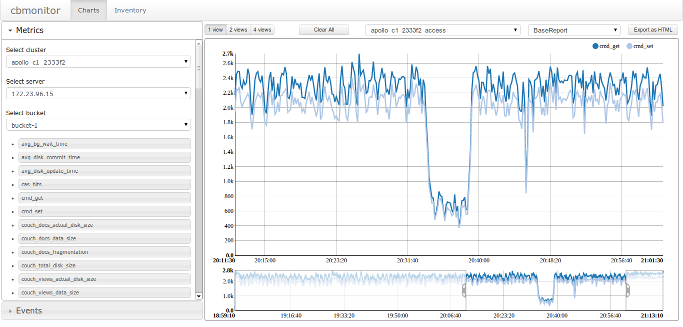

cbmonitor
---------

**cbmonitor** is a web application for stats visualization and report generation.
It also includes set of [cbagent](https://github.com/couchbaselabs/cbagent) collectors so that you can run them via CLI.

Prerequisites
-------------

* Python 2.6 or 2.7
* matplotlib
* libcouchbase
* pip
* [seriesly](https://github.com/dustin/seriesly)

Initial setup
-------------

    $ pip install zc.buildout==1.7.0
    $ make
    $ ./bin/webapp syncdb

Running webapp
--------------

Assuming that seriesly instance is up and running:

    $ ./bin/webapp runserver

Running collectors via CLI
---------------------------

    $ ./bin/ns_collector sample.cfg

Using custom cbagent
--------------------

Just update buildout.cfg:

    [sources]
    cbagent = git https://github.com/couchbaselabs/cbagent.git
